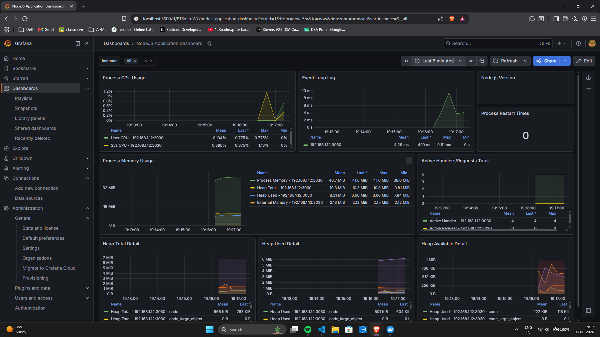

# Node.js Prometheus Monitoring System



## Overview
This project is a Node.js application integrated with **Prometheus** and **Grafana** for real-time monitoring and metrics visualization. It demonstrates how to collect application-level metrics (like request counts and execution times) and system-level metrics (using Node Exporter) to gain insights into service performance.

The application exposes several endpoints that simulate different workloads ("fast", "slow", and "invalid") and provides a `/metrics` endpoint for Prometheus to scrape.

## Project Structure
- `app.js`: Main Express application with Prometheus client integration.
- `docker-compose.yml`: Configures Prometheus and Node Exporter services.
- `prometheus-config.yml`: Global configuration for the Prometheus scraper.
- `Learning.txt`: Project overview and setup notes.

## Endpoints
- `GET /`: Returns a welcome message.
- `GET /fast`: Simulates a fast operation with metric recording.
- `GET /slow`: Simulates a slow operation with metric recording.
- `GET /invalid`: Handles invalid inputs and records error metrics.
- `GET /metrics`: Exposes the Prometheus metrics.

## Setup & Installation

### Prerequisites
- Node.js (v18+)
- Docker and Docker Compose

### 1. Install Dependencies
```bash
npm install
```

### 2. Run the Node.js Application
```bash
node app.js
```
The server will start on `http://localhost:3030`.

### 3. Start Infrastructure (Prometheus & Node Exporter)
Use Docker Compose to launch the monitoring stack:
```bash
docker-compose up -d
```
Prometheus will be available at `http://localhost:9090`.

### 4. Setup Grafana
Run Grafana as a Docker container:
```bash
docker run -d -p 3000:3000 --name=grafana grafana/grafana-oss
```
- Access Grafana at `http://localhost:3000`.
- Connect Grafana to the Prometheus data source (`http://localhost:9090`).
- Create dashboards based on the metrics: `endpoint_requests_total` and `endpoint_execution_time_ms`.

## Metrics Collected
- **Default Metrics**: Standard Node.js runtime metrics (CPU, Memory, Event Loop).
- **Custom Metrics**:
    - `endpoint_requests_total`: Total number of requests per endpoint.
    - `endpoint_execution_time_ms`: Histogram of request durations.

## Important Notes
- The Prometheus configuration uses a static target. Ensure the IP address in `prometheus-config.yml` matches your local machine's IP to allow the Docker container to reach your Node.js application.
- Prometheus scrapes data every 4 seconds as per the `scrape_interval` configuration.
